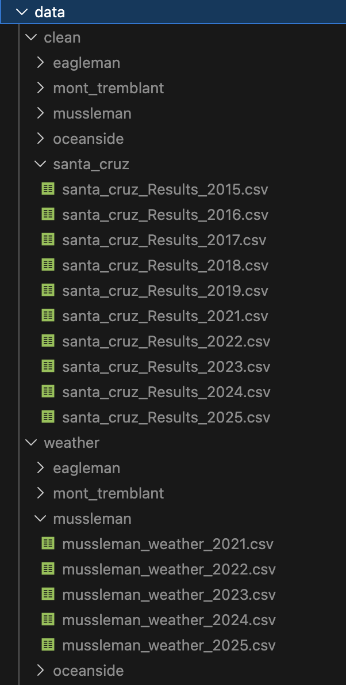

# Half Ironman Race Result Scraper

## Description
A Python-based scraper that collects Ironman race result and weather data, generating CSV files for each race and year. These datasets can then be analyzed in Jupyter to compare conditions, courses, and performance trends.

## Motivation
I am planning on signing up to my first Half Ironman and there are a lot of different factors that I need to consider before making this decision. I decided to choose the top 5 races I was thinking of doing across the US and Canada and gather data to help me make an informed and confident decision. These are just some of the factors that are important to me when choosing my first Half Ironman. I want it to be special. 

For example, I cannot handle high humidity while running. With this program, I am able to gather all the data points needed to answer questions like: What was the average temperature? Was it humid? How fast is the run compared to other races? What about the swim? What are the average times per race? 

## Features
- Scrapes race results from Ironman’s private API
- Extracts event IDs and athlete performance data
- Fetches historical weather using Open-Meteo API
- Converts raw data into clean, structured CSV files
- Supports multiple races and multiple years
- Designed for downstream analysis in Jupyter

## How It Works
1. Race metadata scraping — Parse race pages to collect event IDs and dates.
2. Athlete results scraping — Query the Ironman results endpoint for each event and collect relevant performance metrics.
3. Geolocation lookup — Use Open-Meteo geolocation API to get latitude/longitude for each race.
4. Weather retrieval — Call Open-Meteo to fetch hourly weather for race day, then filter to 6am–4pm to match expected discipline timing.
5. Data cleaning & export — Save each race-year dataset as a CSV for later analysis.

{width=100}

## Tech Stack
Python
Pandas
Requests
Open-Meteo API
JSON / OS

## How to Run
Python 3.13  
Install dependencies: pip install -r requirements.txt  
Run: python main.py  

## Project Structure:
project/ 
* config.py
* scraper.py 
* weather.py 
* main.py 
* data/ 
* README.md 
